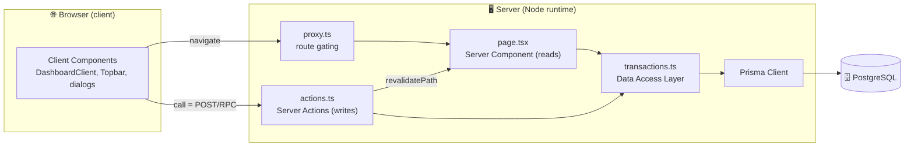
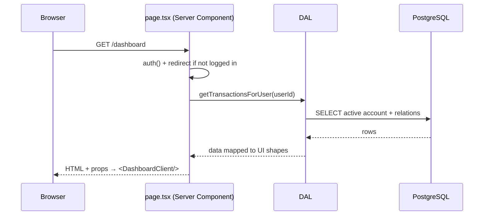
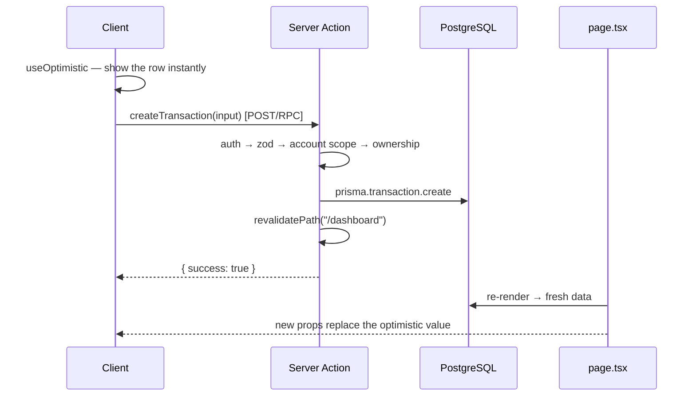
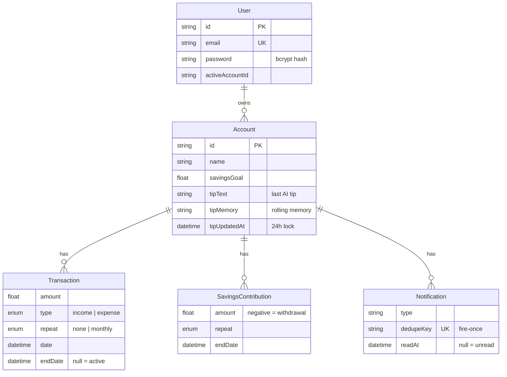

<!-- ══════════════════════════════════════════════════════════════ -->
<!--                            HEADER                               -->
<!-- ══════════════════════════════════════════════════════════════ -->

<div align="center">


<a href="https://readme-typing-svg.demolab.com">
  
</a>

<br/>

<!-- Tech badges -->


<p>
  <b>A full-stack personal-finance dashboard</b> — track accounts, income &amp; expenses,
  recurring payments, savings goals and month-by-month analytics, with an AI daily tip
  and a global command palette. Built end-to-end with the App Router, Server Actions and Prisma.
</p>

</div>

---

## 📑 Table of Contents

- [✨ Overview](#-overview)
- [🎬 Demo](#-demo)
- [🚀 Features](#-features)
- [🛠️ Tech Stack](#️-tech-stack)
- [🏗️ Architecture](#️-architecture)
- [🗄️ Data Model](#️-data-model)
- [🧠 Engineering Highlights](#-engineering-highlights)
- [📂 Project Structure](#-project-structure)
- [⚙️ Getting Started](#️-getting-started)
- [🔐 Environment Variables](#-environment-variables)
- [🗺️ Roadmap](#️-roadmap)
- [👤 Author](#-author)

---

## ✨ Overview

**FinTrack** is a personal-finance dashboard where a single user can manage **multiple accounts**,
each with its own transactions, savings and analytics. Everything is computed from **real data** —
no mock numbers — and the whole app is built on **Next.js Server Components + Server Actions**, so
the backend and frontend live together with no separate REST API.

> The goal was to build something at **production standard** — defense-in-depth security, validation
> at every edge, a clean data-access layer, and a few genuinely non-trivial engineering decisions
> (derived recurring data, optimistic UI, materialize-on-read notifications, LLM grounding).

---

## 🎬 Demo

<div align="center">

<!-- 👉 Drop your real screenshots / GIF into docs/screenshots/ and uncomment below -->
<!--


-->

> 🖼️ **Live demo:** _add your Vercel URL here_ · **Walkthrough:** a recorded GIF goes great right here.

| Dashboard | Analytics | AI Tip &amp; Notifications |
|:---:|:---:|:---:|
| _screenshot_ | _screenshot_ | _screenshot_ |

</div>

---

## 🚀 Features

<table>
<tr>
<td width="50%" valign="top">

### 💳 Accounts & Transactions
- **Multi-account** — switch, create, rename, delete; the active account persists across sessions
- **Income / expense** transactions with categories
- **Recurring (monthly)** payments — one row, derived across months (no cron)
- Stop a recurring item or delete a transaction

### 🐷 Savings
- Set a **savings goal** per account
- **Contribute** and **withdraw** (tracked against your balance)
- 🎉 **Goal-reached** state

</td>
<td width="50%" valign="top">

### 📊 Analytics
- Balance / income / daily-spend **stat cards**
- **Income-vs-expense** chart (monthly & weekly, Recharts)
- **Category donut** + running averages
- **Month period switcher**, bounded to the account's age

### 🤖 Smart layer
- **AI daily tip** (Groq · Llama 3.3 70B) grounded on your real numbers
- **Notifications** — recurring due, goal reached, low balance
- **Command palette** — global search with <kbd>⌘K</kbd>
- 🌙 Light / dark theme

</td>
</tr>
</table>

---

## 🛠️ Tech Stack

| Layer | Technology | Why |
|---|---|---|
| **Framework** | Next.js 16 (App Router) | Server Components + Server Actions → full-stack in one place, no REST boilerplate |
| **UI** | React 19 · TypeScript | `useOptimistic` / `useTransition` for instant UX; type-safety end-to-end |
| **Styling** | Tailwind CSS v4 · shadcn/ui · Radix | Utility CSS + accessible primitives you own in-repo |
| **Database** | PostgreSQL (Supabase) | Relational, robust; Supabase pooler for serverless |
| **ORM** | Prisma 7 (`pg` adapter) | Typed, parameterized queries (SQL-injection safe) + migrations |
| **Auth** | NextAuth v5 · bcrypt · JWT | Credentials provider, hashed passwords, stateless sessions |
| **Validation** | Zod | Runtime validation at every trust boundary |
| **Charts** | Recharts | Declarative, data-as-props |
| **AI** | Groq API | Fast, free, OpenAI-compatible LLM for the daily tip |
| **Deploy** | Vercel | Serverless + edge-aware build |

---

## 🏗️ Architecture

The core idea is the **client / server boundary**. Most code runs on the **server** (Server Components
read the DB directly; Server Actions write to it). Only interactive pieces are `"use client"`.



<details>
<summary><b>📖 Request lifecycle — read vs write</b> (click to expand)</summary>

<br/>

**Read** (loading the dashboard):



**Write** (adding a transaction, with optimistic UI):



</details>

---

## 🗄️ Data Model

A `User` owns many `Account`s; each account owns its transactions, savings and notifications.
Deletes cascade.



---

## 🧠 Engineering Highlights

> The parts I'm most proud of — the non-obvious decisions.

<details open>
<summary><b>🔁 Derived recurring transactions (no cron)</b></summary>

<br/>

A monthly payment (rent, subscription) is stored as **one row** with `repeat: "monthly"` and an
optional `endDate`. Its monthly occurrences are **computed at read time** by counting the months —
no background job, no duplicated rows, no drift.

```ts
// src/lib/derive.ts
function occurrenceCountUntil(item, monthKey) {
  const start = monthKeyOf(item.dateISO);
  if (start > monthKey) return 0;
  if (item.repeat === "none") return 1;
  const end = item.endISO ? monthKeyOf(item.endISO) : null;
  const last = end && end < monthKey ? end : monthKey;
  return monthsBetween(start, last); // e.g. rent from Jan viewed in Apr → 4
}
```
</details>

<details>
<summary><b>⚡ Optimistic UI (useOptimistic + useTransition)</b></summary>

<br/>

New transactions appear **instantly**, then reconcile with the server. `startTransition` keeps the
optimistic value alive while the async Server Action runs; after `revalidatePath`, real props from
the DB replace it. **Single source of truth stays the database.**
</details>

<details>
<summary><b>🔔 Materialize-on-read notifications</b></summary>

<br/>

No cron. On dashboard mount a Server Action **derives** which notifications should exist from real
data and inserts them **idempotently** (`dedupeKey @unique` + `createMany({ skipDuplicates: true })`),
so each event fires **exactly once**. *Event* alerts are kept as history; *condition* alerts
(negative balance / overspend) **self-clear** when the condition no longer holds.
</details>

<details>
<summary><b>🤖 AI grounding + rolling memory</b></summary>

<br/>

LLMs are bad at arithmetic, so the app computes every number **deterministically** and feeds it as a
snapshot — the model only writes the wording. A **rolling memory** (a recompressed summary) gives
day-to-day continuity without an ever-growing prompt, and a **24h lock is enforced on the server**.
Output uses a robust `TIP:` / `MEMORY:` delimiter format (JSON mode was fragile on long text).
</details>

<details>
<summary><b>🔐 Security: DAL boundary · Zod · authZ</b></summary>

<br/>

- A **Data Access Layer** is the single read path; no `select` ever requests `password`, so the hash
  never leaves the server.
- **Zod** validates every Server Action input at runtime.
- Every mutation re-checks **ownership** of the row (anti-IDOR); `proxy.ts` gates `/dashboard`.
- Passwords are **bcrypt**-hashed; sessions are signed **JWT**s.
</details>

---

## 📂 Project Structure

```
src/
├── app/
│   ├── page.tsx                 # landing page
│   ├── login / register/        # auth pages + register Server Action
│   └── dashboard/
│       ├── page.tsx             # Server Component entry (reads via DAL)
│       └── actions.ts           # all Server Actions (writes)
├── server/
│   ├── transactions.ts          # DAL — the single read path
│   ├── notifications.ts         # notification candidate builder
│   └── groq.ts                  # AI tip (Groq call)
├── lib/
│   ├── derive.ts                # pure finance engine (recurring, totals)
│   ├── tip-context.ts           # deterministic AI snapshot
│   └── prisma.ts                # Prisma singleton
├── components/dashboard/        # DashboardClient (orchestrator) + widgets
├── auth.ts                      # NextAuth v5 config
└── proxy.ts                     # middleware (route gating)
prisma/schema.prisma             # data model + migrations
docs/                            # architecture & learning guides (HTML)
```

---

## ⚙️ Getting Started

**Prerequisites:** Node 20+, a PostgreSQL database (e.g. a free [Supabase](https://supabase.com) project), a [Groq API key](https://console.groq.com).

```bash
# 1. Clone & install
git clone https://github.com/alexgheorghitaa/financial-dashboard.git
cd financial-dashboard
npm install            # postinstall runs `prisma generate`

# 2. Configure environment (see table below)
cp .env.example .env.local   # then fill in the values

# 3. Set up the database
npx prisma migrate deploy

# 4. Run
npm run dev            # http://localhost:3000
```

---

## 🔐 Environment Variables

| Variable | Description |
|---|---|
| `DATABASE_URL` | PostgreSQL connection string (Supabase transaction pooler for serverless) |
| `AUTH_SECRET` | NextAuth signing secret — generate with `npx auth secret` |
| `GROQ_API_KEY` | Groq API key for the AI daily tip |

> On Vercel, set the same three variables in **Project → Settings → Environment Variables**.

---

## 🗺️ Roadmap

- [ ] Unit tests for the pure finance engine (`derive.ts`) — Vitest
- [ ] Password reset & email verification (token flow)
- [ ] Harden recurring-savings affordability (known edge case)
- [ ] CSV / data export
- [ ] Budgets per category

---

## 👤 Author

**Alexandru Gheorghiță**
[](https://github.com/alexgheorghitaa)

<div align="center">
<sub>Built with Next.js 16 · React 19 · Prisma 7 · PostgreSQL — as a production-standard learning project.</sub>


</div>
